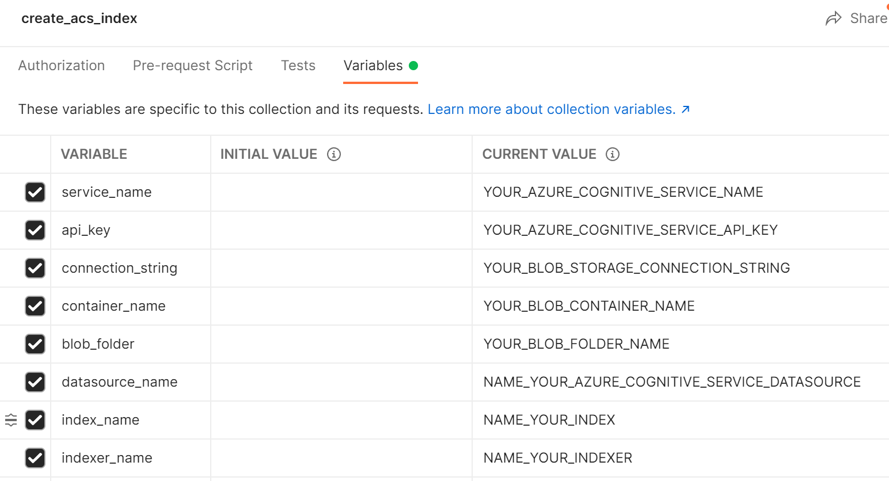
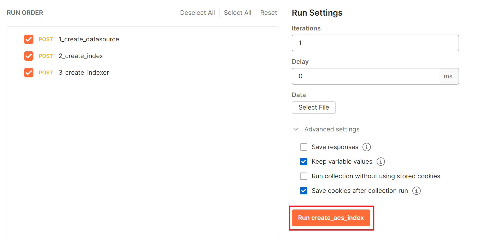
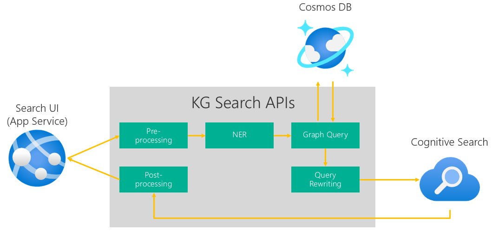

# Knowledge Graph Powered Search Accelerator

This accelerator provides the code template to implement a domain-aware search solution that uses knowledge graph (KG) to enrich the organic results of a general purpose search engine. The use of the accelerator is demonstrated through an example implementation of a medical document retrieval solution. The example implementation uses a knowledge graph to expand the scope of search from the original query to semantically related queries to uncover documents that are relevant to the original query but may not contain the exact keywords. 

 <!-- the original query.  to uses a medical knowledge graph to expand search perform search across the well-known [OHSUMED](https://link.springer.com/chapter/10.1007/978-1-4471-2099-5_20) medical dataset.  -->

<p align="center"></p>


https://user-images.githubusercontent.com/64599697/193975237-faa5b810-3c8d-4836-8fd3-3a9585728049.mp4


## Knowledge Graph to Enhance Search Results

Knowledge graph has been widely used to enhance search results by interpreting user intent based on semantic meaning of search terms. It is commonly applied to the following two search enhancement scenarios:

* **Search refinement**: Knowledge graph can be used to refine search results by recognizing different meanings of a search term (e.g. "apple" can be a company or fruit). When search ambiguity is detected from knowledge graph a search engine can provide a refining option to the users to select a slice of the results based on their intent.

* **Search expansion**: Knowledge graph can also be used to expand search results through the relationships of the entities present in the search queries. For example [Uber Eats](https://www.uber.com/en-AU/blog/uber-eats-query-understanding/) uses a food knowledge graph to expand search from the original query to related terms to help their customers find food options that they had not considered (e.g. expand search from "udon" to terms such as "ramen", "soba", and "Japanese").

The code template provided by this solution acceleration is applicable to both search refinement and search expansion scenarios.


## An Example KG-Powered Search Scenario

To demonstrate the use of the solution accelerator, this repo provides an example of using knowledge graph for search expansion in the context of medical document retrieval. 

An example knowledge graph is created based on [Unified Medical Language System (UMLS)](https://www.nlm.nih.gov/research/umls/index.html), which is a set of files and software that brings together health and biomedical vocabularies and standards to enable interoperability between computer systems. We create an example knowledge graph based on an [ontology](https://en.wikipedia.org/wiki/Ontology_(information_science)) as shown below to capture the relationships between various [keratoconus](https://www.hopkinsmedicine.org/health/conditions-and-diseases/keratoconus)-related diseases and their corresponding treatments. 


In a medical document retrieval scenario, parent (hypernym) and children (hyponyms) of a disease are considered to be highly related, hence are natural candidates for search expansion. The example search engine is therefore designed to automatically expand a disease term in the original query to related parent and children diseases. For example, the search engine will expand "keratoconus" to its parent and children diseases: "protrusion", "corneal disease", "corneal ectasia", "stable condition keratoconus", and "acute hydrops keratoconus". 

# Solution Design

This accelerator implements the following solution design consisting of 4 key components: 

* **Front-End UI**: A front-end application to surface the final search results to the end users.
* **Graph DB**: A graph database to host the knowledge graph. [Azure Cosmos DB with Gremlin API](https://docs.microsoft.com/en-us/azure/cosmos-db/graph/graph-introduction) is used in our implementation.
* **Search Index**: A general purpose search engine to index and query the provided data. [Azure Cognitive Search](https://docs.microsoft.com/en-us/azure/search/search-what-is-azure-search) is used to index the data stored in the Azure Data Lake Storage (Gen 2) container.
* **KG Search API**: An API that encapsulates the following workflow for KG-powered search expansion/refinement:
    
    1. **Preprocessing**: Preprocess the search query, e.g. remove domain-specific stop words.
    2. **NER**: Apply a Named Entity Recognition (NER) model to the preprocessed query to extract entities of interest. As NER is not the focus of this accelerator the example code uses a simple rule-based NER procedure. One can replace this simple implementation with an ML-based NER model to recognize domain-specific entities, e.g. by training a custom NER model using [Azure Cognitive Service for Language](https://docs.microsoft.com/en-us/azure/cognitive-services/language-service/custom-named-entity-recognition/overview). Refer to ```api/search_expansion/nerprocessing/ner.py``` for NER model input and output formats. 
    3. **Graph Query**: Take the NER result as the input, and query the KG for related entities (and corresponding entity properties if required).
    4. **Query Rewriting**: Rewrite the search query based on the the entities (and entity properties) retrieved from the KG. 
    5. **Index Query**: Submit the rewritten query to the search engine.
    5. **Postprocessing**: Apply postprocessing logic to the search results returned by the search engine, e.g. apply persona-based filtering or any re-ranking logic. The postprocessed results are surfaced to the end users through the front-end UI.

The example code in this repo implements a search expansion approach based on the above solution design. One can adapt the implementation for other search scenarios as well, specifically the scenarios that can benefit from the use of a domain-specific knowledge graph. 

## Prerequisite

You need to have an Azure subscription with the access to the following resources: 

| Azure Resources      | Description | Note |
| ----------- | ----------- | --------------|
| Azure Data Lake Storage | To store the data   | Use [Azure Data Lake Storage Gen2](https://docs.microsoft.com/en-us/azure/storage/blobs/data-lake-storage-introduction)
| Azure Cognitive Search      | To index the data from the data lake   |
| Azure Cosmos DB with Gremlin API      | To store the knowledge graph | Cosmos DB is a Labelled Property Graph (LPG) store
| App Service Plan   | To host two applications: the front-end UI and the KG Search API, respectively | App service plan is required for app deployment to Azure. When creating an app service plan select Linux as the OS. 

<!--Refer to this [instruction](https://docs.microsoft.com/en-us/azure/app-service/quickstart-python?tabs=flask%2Cwindows%2Cvscode-aztools%2Cvscode-deploy%2Cdeploy-instructions-azportal%2Cterminal-bash%2Cdeploy-instructions-zip-azcli#2---create-a-web-app-in-azure) for app deployment from [VS Code](https://code.visualstudio.com/). One can also follow the instruction below to run the apps locally for testing. To protect the KG search API one should add an authentication mechanism. For example, we configure API authentication to use Azure AD as the authentication provider, cf. the configuration guide [here](https://docs.microsoft.com/en-us/azure/app-service/configure-authentication-provider-aad#--option-1-create-a-new-app-registration-automatically). -->


<!-- Provision the following Azure resources in your own subscription: 
1. An Azure App Service to host the frontend application (We recommend to create the App Service using VS Code: [following this link](https://docs.microsoft.com/en-us/azure/app-service/quickstart-python?tabs=flask%2Cwindows%2Cvscode-aztools%2Cvscode-deploy%2Cdeploy-instructions-azportal%2Cterminal-bash%2Cdeploy-instructions-zip-azcli#2---create-a-web-app-in-azure). You can skip the Deployment of the code first. We will revisit this in the later step.)
2. An Azure App Service to host the search APIs
3. A cognitive search service to index the documents
4. A Blob storage to stage the sample documents
5. A Cosmos DB instance with Gremlin API to store the Knowledge Graph

Besides, we assume the search APIs will be protected by token authentication. So, you need to configure the authentication provider for the search APIs App Service. We simply configure Azure AD login following this [guide](https://docs.microsoft.com/en-us/azure/app-service/configure-authentication-provider-aad#--option-1-create-a-new-app-registration-automatically).   

After the frontend App Service is deployed, you need to add the following environment variables in the [Application settings](https://docs.microsoft.com/en-us/azure/app-service/configure-common?tabs=portal):
```
# Search API Secret
SEARCH_API_URL # the URL of the search APIs App Service.
SEARCH_AUTH_URL # the URL of the authentication provider, it should be https://login.microsoftonline.com/{tenant id}/oauth2/token if Azure AD login is configured
SEARCH_GRANT_TYPE # simply set it as client_credentials
SEARCH_CLIENT_ID # the client id when you registered in the identity provider for the search APIs App Service. 
SEARCH_CLIENT_SECRET # a client secret for the application you registered in the identity provider. Follow this https://docs.microsoft.com/en-us/azure/active-directory/develop/howto-create-service-principal-portal#option-2-create-a-new-application-secret to create a client secret if you don't have.   

# Configuration for UI Application
APP_SECRET_KEY  # The secret key for frontend application to maintain cookies
MAX_CONTENT_SIZE  # The content size setting used by the frontend application. Set it as 200.  
```

Similarly, you need to add the following environment variables for the search APIs App Service:
```
# Azure Cognitive Configuration
ACS_ENDPOINT # The url of ACS endpoint 
ACS_API_KEY # The access key of the ACS 
ACS_INDEX_NAME # The index name you want to use in ACS, e.g., ohsumed
ACS_API_VERSION # The API version of ACS, we have tested on 2021-04-30-Preview only 

# Cosmos DB Configuration
COSMOS_DB_SERVER # The address of the Cosmos DB server
COSMOS_DB_DATABASE # The database you create in Cosmos DB
COSMOS_DB_GRAPH # The graph collection in the above database that actually stores the KG
COSMOS_DB_PASSWORD # The access key to the Cosmos DB
```

### Deploy the source code to App Service
Currently, both the search APIs and frontend application source code are sitting in the same repository. We need to configure the startup command in both App Services such that they can pick up the right code to run. Following this [guide](https://docs.microsoft.com/en-us/azure/developer/python/configure-python-web-app-on-app-service#create-a-startup-file) to change the startup command.

For the search APIs App Service, set the startup command as:
```
gunicorn --bind=0.0.0.0 --timeout 600 --chdir api app:app
```

For the frontend App Service, set the startup command as:
```
gunicorn --bind=0.0.0.0 --timeout 600 --chdir ui app:app
```

You may first need to clone the repository to your machine if you did not.
In Visual Code, you can now continue the deploy step by following this [link](https://docs.microsoft.com/en-us/azure/app-service/quickstart-python?tabs=flask%2Cwindows%2Cvscode-aztools%2Cvscode-deploy%2Cdeploy-instructions-azportal%2Cterminal-bash%2Cdeploy-instructions-zip-azcli#2---create-a-web-app-in-azure). You can also choose other deployment methods like command line deployment in the same page of the previous link. -->

## Getting Started

1. Create a virtual environment. The solution accelerator is tested with Python 3.8. 
    ```
    conda create -n kg-search python=3.8
    conda activate kg-search
    ```

2. Clone the repo and install python dependencies:
    ```
    git clone https://github.com/microsoft/dstoolkit-kg-search.git
    cd dstoolkit-kg-search
    pip install -r requirements.txt
    ```

3. Prepare example medical data for indexing. We use the Hugging Face [OHSUMED](https://huggingface.co/datasets/ohsumed) dataset for the demo. It is a set of 348,564 references from MEDLINE, an online medical information database, consisting of titles, abstracts, and other metadata from 270 medical journals over a five-year period (1987-1991). Run the following command to download the OHSUMED dataset from the Hugging Face data repository, and extract individual entries from the dataset into separate JSON files for subsequent indexing:
    ```
    python scripts/prepare_data.py -o your_output_directory
    ```

4. Upload the JSON files created in the previous step to a folder in an Azure Data Lake blob container, see an example below.


5. Import `scripts/create_acs_index.postman_collection.json` into [Postman](https://learning.postman.com/docs/getting-started/importing-and-exporting-data/#importing-data-into-postman) to create a Postman collection named "create_acs_index". The collection contains the following Azure Cognitive Search API calls that can be run in the following order to index the OHSUMED JSON files from the blob container:
    * 1_create_datasource: Create a [data source](https://docs.microsoft.com/en-us/rest/api/searchservice/create-data-source) to connect to the OHSUMED data in the blob container.
    * 2_create_index: Define an [index](https://docs.microsoft.com/en-us/rest/api/searchservice/create-index) schema to host the data.
    * 3_create_indexer: Create [an indexer](https://docs.microsoft.com/en-us/rest/api/searchservice/create-indexer) to index the OHSUMED data to the defined index. 

     Before running the Postman collection, [edit the collection variables](https://learning.postman.com/docs/sending-requests/variables/#defining-collection-variables) in Postman accordingly. Set `datasource_name`, `index_name`, and `indexer_name` based on your preferred naming choice. The rest of the variables should be set according to your Azure service setup.  
     
     Having configured the collection variables, you can [run the collection](https://learning.postman.com/docs/running-collections/intro-to-collection-runs/#configuring-a-collection-run) in the order as shown below to start indexing the OHSUMED data. 

    To review the indexing progress you can go to the Azure Cognitive Search Overview page on the Azure Portal. Upon successful completion of the indexing, the document count of your created index should reach 348,564:
      


6. Create a graph instance in the Cosmos DB. You can create a graph in Cosmos DB programmatically, or as shown below by using the Data Explorer tool in the Azure portal. Select **Data Explorer > New Graph**, provide a database ID, a graph ID, and set partition key to "/pk":
    

7. Ingest the example KG to the above created graph instance in Cosmos DB. First create a `.env` file in the root directory of the repository, and fill in the values for the following variables (**Note**: `.env` is meant to be used in local mode. It is already added to the `.gitignore` file to avoid accidental commit of credentials to a repo):

    ```
    # Cosmos DB Configuration
    COSMOS_DB_SERVER=    # The address of the Cosmos DB server, i.e., the Gremlin Endpoint displayed on the Cosmos DB Overview page in the Azure Portal
    COSMOS_DB_DATABASE=  # The database you create in Cosmos DB
    COSMOS_DB_GRAPH=     # The graph collection in the above database that stores the KG
    COSMOS_DB_PASSWORD=  # The access key to the Cosmos DB
    ```
    Then run the following command to create a keratoconus knowledge graph, cf. the ontology and knowledge graph introduced in the example search scenario discussion:
    ```
    python scripts/initialize_graph.py
    ```

7. Deploy the front-end UI and KG search API (both are Flask apps) locally or to Azure: 
    
    **Local deployment (for testing)**: 
    * To deploy the apps locally, first edit the `.env` file created above for KG creation with the following additional variables: 

        ```
        # Azure Cognitive Search Configuration
        ACS_ENDPOINT=       # The url of ACS endpoint 
        ACS_API_KEY=        # The access key of ACS 
        ACS_INDEX_NAME=     # The index name you want to use in ACS, e.g.ohsumed
        ACS_API_VERSION=    # The API version of ACS, tested with 2021-04-30-Preview 

        # Cosmos DB Configuration (same as used for KG creation above)
        COSMOS_DB_SERVER=   # The address of the Cosmos DB server
        COSMOS_DB_DATABASE= # The database you create in Cosmos DB
        COSMOS_DB_GRAPH=    # The graph collection in the above database that stores the KG
        COSMOS_DB_PASSWORD= # The access key to the Cosmos DB

        # Search API Configuration
        SEARCH_API_URL=     # The URL of the KG search API. In case of local development it should point to your local URL.
        LOCAL_DEBUG=1       # Set local debug to 1 to bypass authentication

        # Front-end UI Configuration
        APP_SECRET_KEY=     # The secret key for front-end application to maintain cookies. It can be an arbitrary string. 
        MAX_CONTENT_SIZE=200  # The content size setting used by the frontend application. Default to 200.
        ```
    * Run the following command under the ```api``` folder to activate the KG Search API. You can use a different port number. The resulting URL (http://127.0.0.1:5000) should be the same as ```SEARCH_API_URL``` in the ```.env``` file.

        ```
        flask run --host=0.0.0.0 --port=5000
        ```
    * Run the following command under the ```ui``` folder to start the front-end application.
        ```
        flask run --host=0.0.0.0 --port=5001
        ```
    * You can now visit the front-end application at http://127.0.0.1:5001. Type in a query such as "keratoconus treatment", then click the "Search" button to search. You can toggle "KG Enabled" option on and off to compare the results with and without KG augmentation. You are likely to see more results with the "KG Enabled" option on if your query contains a disease term that is present in the example keratoconus KG. In that case the search is expanded from the original query to a query containing all the related diseases. 
    

    **Azure deployment**: 
    1. Deploy the KG Search API. We recommend to use VS Code to deploy the App Service. You need to install [Azure Tools extension pack](https://marketplace.visualstudio.com/items?itemName=ms-vscode.vscode-node-azure-pack) and sign into Azure from VS code. Once install the extension, select the Azure Tools icon. Then, right click on "App Services" and choose "Create New Web App.. (Advanced)". It will ask you to input the app service name, resource group, App Service Plan etc. Once you provide all the information, the app service will be automatically created and shown as a new item under "App Services". 
    

       After create the App Service, you can now deploy the source code by right-clicking your targeted App Service. Then choose "Deploy to Web App..." option. It will ask you to select the root folder of the source code. Simply select the root folder of this repository.
    
    
    2. Configure the authentication for the KG search API. To configure the authentication, go to KG Search API App Service in Azure Portal. Select "Autentication" and then click "Add identity provider".
    
    
       In the next page, select Microsoft as the identity provider, and provide the name of the App registration. Finally, click the add button at the bottom to finish the configuration. 
    
    
       Once done, you will find an identity provider created. 
    

    3. Edit KG Search API application settings. To let the KG Search API be able to access the underlying ACS and Cosmos DB, we need to add the connection properties as environment variables in the application settings.
    
       Here is the description of the above enviroment variables:
       ```
       # Azure Cognitive Configuration
       ACS_ENDPOINT # The url of ACS endpoint 
       ACS_API_KEY # The access key of the ACS 
       ACS_INDEX_NAME # The index name you want to use in ACS, e.g., ohsumed
       ACS_API_VERSION # The API version of ACS, we have tested on 2021-04-30-Preview only 

       # Cosmos DB Configuration
       COSMOS_DB_SERVER # The address of the Cosmos DB server
       COSMOS_DB_DATABASE # The database you create in Cosmos DB
       COSMOS_DB_GRAPH # The graph collection in the above database that actually stores the KG
       COSMOS_DB_PASSWORD # The access key to the Cosmos DB
       ```
    
       Apart from adding the environment varibles, you also need to tell which application this app service will run because this repository contains both the KG Search API and front-end applications. To do that, you need to configure the "Startup Command" for your application as bellow:
       ```
       gunicorn --bind=0.0.0.0 --timeout 600 --chdir api app:app
       ```
    

    4. Create client secret for the App registration. The App registration created in step 2 will be used to conduct Oauth 2.0 authentication by the front-end application. To achieve that, we need to first create the client secret for the App registration. Find the App registration you created in step 2 in your Active Directory, then click "New client secret" to create a secret. Don't forget to save the secret since it will be used in the configuration of the front-end app service later on.  
     
    
    5. Deploy front-end application. You can follow the same instructions in step 1 to create a new App Service and deploy the source code for the front-end application. Again, simply choose the root directory of the repository as the deployment target.
    
    6. Edit front-end app settings. Add the following environment variables in the front-end App Service.
      
       Here is the description of the above enviroment variables:
       ```
       # Search API Secret
       SEARCH_API_URL # the URL of the search APIs App Service.
       SEARCH_AUTH_URL # the URL of the authentication provider, it should be https://login.microsoftonline.com/{tenant id}/oauth2/token if Azure AD login is configured
       SEARCH_GRANT_TYPE # simply set it as client_credentials
       SEARCH_CLIENT_ID # the client id when you registered in the identity provider for the search APIs App Service. 
       SEARCH_CLIENT_SECRET # a client secret for the application you registered in the identity provider. Follow this https://docs.microsoft.com/en-us/azure/active-directory/develop/howto-create-service-principal-portal#option-2-create-a-new-application-secret to create a client secret if you don't have.   

       # Configuration for UI Application
       APP_SECRET_KEY  # The secret key for frontend application to maintain cookies
       MAX_CONTENT_SIZE  # The content size setting used by the frontend application. Set it as 200.  
       ```
       
       After that, follow the instructions in step 3 to configure the "Startup Command" for the front-end application as bellow. 
       ```
       gunicorn --bind=0.0.0.0 --timeout 600 --chdir ui app:app
       ```
 
       To check the deployment, you can open the home page of the front-end application and input the search "keratoconus treatment". If there is result returns, then it means your deployment is successful. You can find the URL of the front-end application in the overview page as below:
       

## Code Structure

<!-- You can reuse differnet parts of the code for your own application. The key component here is the search APIs. You can completely replace the frontend application by your own one. To adapt the search APIs to you specific scenario, you need to adjust the code accordingly. Below is the detailed breakdown of the search APIs. There are five main components:
* Preprocessing: conduct any preprocessing logic of the search query, e.g., removing domain specific stop words.
* NER: conduct NER to the preprocessed search text
* Graph Query: take the NER result as input, retrieve the relevant entities from the KG
* Query Rewriting: rewrite the original search query. It will be the final query being submitted to ACS
* Postprocessing: include any postprocessing logic here, e.g., user based filtering or re-ranking 


Every component has a base class defined. You can create your own class by inheriting the corresponding base class. The whole solution will work seamlessly if you follow the same API designed.  -->

```
├───api              # folder containing the KG search API components
│   ├───app.py       # the api web service
│   └───search_expansion    # the search expansion component
│       ├───kg              # extract relevant entities from KG
|       ├───nerprocessing   # extract entities of interest from search query
|       ├───postprocessing  # postprocess the Azure Cognitive Search result before sending back to front-end application
|       ├───preprocessing   # preprocess the original search query
|       ├───rewriting       # rewrite the original search query
|       ├───search_expander.py   # control the whole execution flow
|       ├───search_sdk.py   # encapsulate the API for the underlying search engine
│       └───util.py
├───config      # configuration for log or other non-credential settings
├───docs
│   ├───media   # storing images, videos, etc, needed for docs.
├───scripts     # scripts for preparing data
├───tests       # unit tests
|── ui          # the front-end application
├── .gitignore
├── README.md
└── requirement.txt # Python dependencies
```
## Contributing

This project welcomes contributions and suggestions.  Most contributions require you to agree to a
Contributor License Agreement (CLA) declaring that you have the right to, and actually do, grant us
the rights to use your contribution. For details, visit https://cla.opensource.microsoft.com.

When you submit a pull request, a CLA bot will automatically determine whether you need to provide
a CLA and decorate the PR appropriately (e.g., status check, comment). Simply follow the instructions
provided by the bot. You will only need to do this once across all repos using our CLA.

This project has adopted the [Microsoft Open Source Code of Conduct](https://opensource.microsoft.com/codeofconduct/).
For more information see the [Code of Conduct FAQ](https://opensource.microsoft.com/codeofconduct/faq/) or
contact [opencode@microsoft.com](mailto:opencode@microsoft.com) with any additional questions or comments.

## Trademarks

This project may contain trademarks or logos for projects, products, or services. Authorized use of Microsoft 
trademarks or logos is subject to and must follow 
[Microsoft's Trademark & Brand Guidelines](https://www.microsoft.com/en-us/legal/intellectualproperty/trademarks/usage/general).
Use of Microsoft trademarks or logos in modified versions of this project must not cause confusion or imply Microsoft sponsorship.
Any use of third-party trademarks or logos are subject to those third-party's policies.
