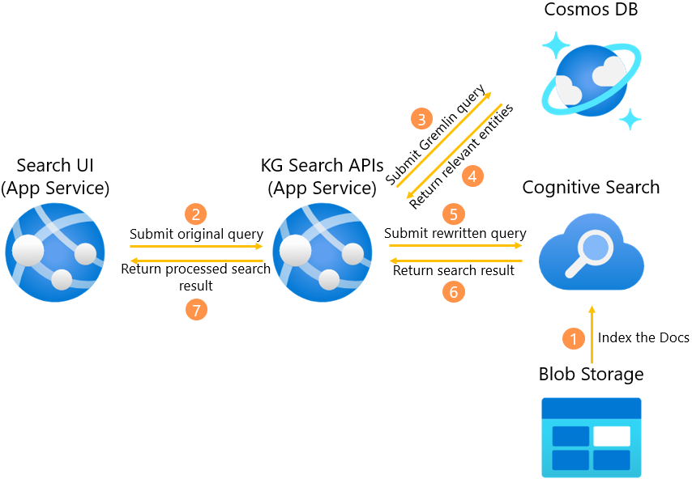
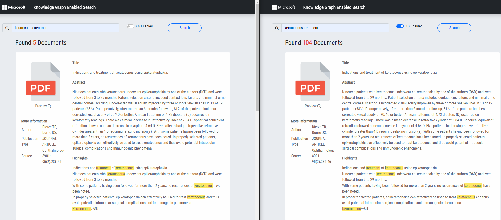

# Knowledge Graph Enabled Search Accelerator

This repo contains the core components for the Knowledge Graph Enabled Search solution.
The solution is designed as a template such that you can reuse the basic structure of the solution by overwriting its individual components based on the requirement of your application. 
For example, you can ingest your own knowledge graph and implement your own query rewriting logic that tailored to your application.

The solution can be generalized to different kind of industries. In this template, we use a sample knowledge graph and documents from medical domain to demonstrate the end-2-end solution. 

# Why introducing knowledge graph to search engine

For general search engine like Lucene, Azure Cognitive Search, etc., they index the documents by terms and rank the results based on term frequency. These search engines, however, are not designed to interpret the complex mental associations humans naturally create between various concepts. 

Here is an example by [Uber Eat](https://eng.uber.com/uber-eats-query-understanding/): an eater might have a certain type of food in mind, but choose something else while browsing the app. For example, an eater might search for udon, but end up ordering soba. In this case, the eater may have been looking for something similar to udon, such as soba and ramen, instead of only being interested in udon. As humans, it might seem obvious; Udon and soba are somewhat similar, Chinese and Japanese are both Asian cuisines. However, machines have a more difficult time understanding these similarities only based on the textual information. In fact, a lot of work goes into training them to make these types of intelligent decisions on the semantic level. 

Uber's solution is to first build a food knowledge graph. Then, based the knowledge graph, it will try to interpret the intent behind user's search. In the above example, the knowledge graph will tell us that udon is similar to ramen and soba, and it is a kind of Japanese food. So, besides of searching "udon", it will also search for "ramen", "soda" and other "Japanese" food. This can provide more options to the user that better meet his/her intention. Especially, it will be very useful when there is no restaurant nearby is selling "udon".    

<figure>

<!-- <figcaption align = "center"><b>Fig.1 - Food Knowledge Graph</b></figcaption> -->
</figure>

## Prerequisites
 
In order to successfully complete your solution, you will need to have access to and or provisioned the following: 

* Access to an Azure subscription

## Getting Started

### Infrastructure Setup

Below is the architecture used by this solution. Both App Services are running a Flask application. One can extend it based on the actual requirement. For example, it is natural to adding tool like Azure Data Factory to orchestrate the data ingestion part.


Provision the following Azure resources in your own subscription: 
1. An Azure App Service to host the frontend application (We recommend to create the App Service using VS Code: [following this link](https://docs.microsoft.com/en-us/azure/app-service/quickstart-python?tabs=flask%2Cwindows%2Cvscode-aztools%2Cvscode-deploy%2Cdeploy-instructions-azportal%2Cterminal-bash%2Cdeploy-instructions-zip-azcli#2---create-a-web-app-in-azure). You can skip the Deployment of the code first. We will revist this in the later step.)
2. An Azure App Service to host the search APIs
3. A cognitive search service to index the documents
4. A Blob storage to stage the sample documents
5. A Cosmos DB instance with Gremlin API to store the Knowledge Graph

Besides, we assume the search APIs will be protected by token authentication. So, you need to configure the authentication provider for the search APIs App Service. We simply configure Azure AD login following this [guide](https://docs.microsoft.com/en-us/azure/app-service/configure-authentication-provider-aad#--option-1-create-a-new-app-registration-automatically).   

After the frontend App Service is deployed, you need to add the following environment variables in the [Application settings](https://docs.microsoft.com/en-us/azure/app-service/configure-common?tabs=portal):
```
# Search API Secret
SEARCH_API_URL # the URL of the search APIs App Service.
SEARCH_AUTH_URL # the URL of the authentication provider, it should be https://login.microsoftonline.com/{tenant id}/oauth2/token if Azure AD login is configured
SEARCH_GRANT_TYPE # simply set it as client_credentials
SEARCH_CLIENT_ID # the client id when you registered in the identity provider for the search APIs App Service. 
SEARCH_CLIENT_SECRET # a client secret for the application you registered in the identity provider. Follow this https://docs.microsoft.com/en-us/azure/active-directory/develop/howto-create-service-principal-portal#option-2-create-a-new-application-secret to create a client secret if you dont have.   

# Configuration for UI Application
APP_SECRET_KEY  # The secret key for frontend application to maintain cookies
MAX_CONTENT_SIZE  # The content size setting used by the frontend application. Set it as 200.  
```

Similarly, you need to configure the following environment variables for the search APIs App Service:
```
# Azure Cognitive Configuration
ACS_ENDPOINT # The url of ACS endpoint 
ACS_API_KEY # The access key of the ACS 
ACS_INDEX_NAME # The index name you want to use in ACS, e.g., ohsumed
ACS_API_VERSION # The API version of ACS, we have tested on 2021-04-30-Preview only 

# Cosmos DB Configuration
COSMOS_DB_SERVER # The address of the Cosmos DB server
COSMOS_DB_DATABASE # The database you create in Cosmos DB
COSMOS_DB_GRAPH # The graph collection in the above database that actually stores the KG
COSMOS_DB_PASSWORD # The access key to the Cosmos DB
```

### Prepare Sample Data
We are using the Hugging Face [dataset](https://huggingface.co/datasets/ohsumed) to demo the end-2-end solution. It is a set of 348,566 references from MEDLINE, the on-line medical information database, consisting of titles and/or abstracts from 270 medical journals over a five-year period (1987-1991).
For the knowledge graph, we simply create a small instance based on the Ontology described in [Unified Medical Language System (UMLS)](https://www.nlm.nih.gov/research/umls/index.html), which is a set of files and software that brings together many health and biomedical vocabularies and standards to enable interoperability between computer systems.


1. Git clone the whole repository.

2. Create Virtual Environment using venv or conda. The current solution is only tested in python 3.8. For example:
```
conda create -n kg-search python=3.8
conda activate kg-search
```

3. Navigate to the cloned repository and install python dependency:
```
python -m pip install -r requirements.txt
```

4. Create a .env file in root directory and fill in the value for the following properties:
```
# Cosmos DB Configuration
COSMOS_DB_SERVER=    # The address of the Cosmos DB server
COSMOS_DB_DATABASE=    # The database you create in Cosmos DB
COSMOS_DB_GRAPH=     # The graph collection in the above database that actually stores the KG
COSMOS_DB_PASSWORD=    # The access key to the Cosmos DB
```

5. Initialize the KG. Navigate to the script folders and run:
```
python initialize_graph.py
```

6. Prepare the sample data set as JSON files:
```
python prepare_data.py -o [the output drectory]
```

7. Upload the output files to the Blob storage you created before.

8. Import the file "scripts/create_acs_index.postman_collection.json" into [PostMan](https://www.postman.com/). Submit the following requests one by one:
    * send "1_create_datasource" request to create the data source in ACS by setting the following values: 
      * {service_name} in URL to your ACS name;
      * {api_key} in Headers to your ACS access key;
      * {datasource_name} in Body to the data source name you want to use in ACS
      * {connection_string} in Body to the blob storage
      * {container} in Body to the contain name
      * {blob_folder} in Body to the folder that stores the sample data in Blob
    * send "2_create_index" request to create the index in ACS by setting the following values:
      * {service_name} in URL to your ACS name;
      * {api_key} in Headers to your ACS access key;
      * {index_name} in Body to the index name you want to use in ACS 
    * send "3_create_indexer" request to run the indexer in ACS by setting the following values:
      * {service_name} in URL to your ACS name;
      * {api_key} in Headers to your ACS access key;
      * {indexer_name} in Body to the indexer name you want to use in ACS 
      * {datasource_name} in Body to the data source name you want to use in ACS
      * {index_name} in Body to the index name you want to use in ACS 

## Deploy the code to App Service

Currently, both the search APIs source code and frontend application source code are sitting in the same repository. We need to configure the startup command in both App Services such that they can pick up the right code to run. Following this [guide](https://docs.microsoft.com/en-us/azure/developer/python/configure-python-web-app-on-app-service#create-a-startup-file) to change the startup command.

For the search APIs App Service, set the startup command as:
```
gunicorn --bind=0.0.0.0 --timeout 600 --chdir api app:app
```

For the frontend App Service, set the startup command as:
```
gunicorn --bind=0.0.0.0 --timeout 600 --chdir ui app:app
```

If you are using Visual Code, you can now continue the deploy step by following this [link](https://docs.microsoft.com/en-us/azure/app-service/quickstart-python?tabs=flask%2Cwindows%2Cvscode-aztools%2Cvscode-deploy%2Cdeploy-instructions-azportal%2Cterminal-bash%2Cdeploy-instructions-zip-azcli#2---create-a-web-app-in-azure). You can also choose other deployment methods like command line deployment in the same page of the previous link.

Once you finish all the steps above, you can now browse the home page of the frontend application. Type in the search text "keratoconus treatment" and then click the search button, you should see the results listed in your page. You can try different search by switching the "KG Enabled" option on or off. Ideally, you will see more results returned when the "KG Enabled" is on since it will include the search results for those similar disease to keratoconus as well.  


## Adapt the solution to your domain

## Contributing

This project welcomes contributions and suggestions.  Most contributions require you to agree to a
Contributor License Agreement (CLA) declaring that you have the right to, and actually do, grant us
the rights to use your contribution. For details, visit https://cla.opensource.microsoft.com.

When you submit a pull request, a CLA bot will automatically determine whether you need to provide
a CLA and decorate the PR appropriately (e.g., status check, comment). Simply follow the instructions
provided by the bot. You will only need to do this once across all repos using our CLA.

This project has adopted the [Microsoft Open Source Code of Conduct](https://opensource.microsoft.com/codeofconduct/).
For more information see the [Code of Conduct FAQ](https://opensource.microsoft.com/codeofconduct/faq/) or
contact [opencode@microsoft.com](mailto:opencode@microsoft.com) with any additional questions or comments.

## Trademarks

This project may contain trademarks or logos for projects, products, or services. Authorized use of Microsoft 
trademarks or logos is subject to and must follow 
[Microsoft's Trademark & Brand Guidelines](https://www.microsoft.com/en-us/legal/intellectualproperty/trademarks/usage/general).
Use of Microsoft trademarks or logos in modified versions of this project must not cause confusion or imply Microsoft sponsorship.
Any use of third-party trademarks or logos are subject to those third-party's policies.
